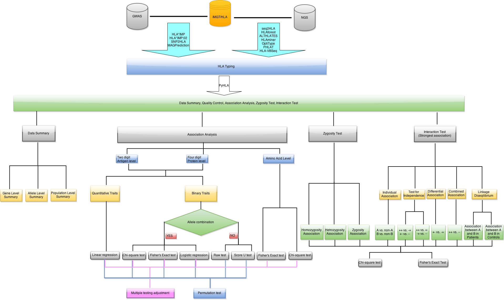

# PyHLA: tests for association between HLA alleles and diseases
Yanhui Fan  
April 22, 2016  


Table of Contents
=================

  * [PyHLA: tests for association between HLA alleles and diseases](#pyhla-tests-for-association-between-hla-alleles-and-diseases)
  * [1\. Introduction](#1-introduction)
  * [2\. Installation](#2-installation)
    * [2\.1 Requirement](#21-requirement)
    * [2\.2 Installation](#22-installation)
    * [2\.3 Getting Started](#23-getting-started)
  * [3\. Tutorials](#3-tutorials)
    * [3\.1 Input](#31-input)
      * [3\.1\.1 HLA Types File (\-\-file)](#311-hla-types-file---file)
      * [3\.1\.2 Exclude Alleles File (\-\-exclude)](#312-exclude-alleles-file---exclude)
      * [3\.1\.3 Covariates file (\-\-covar)](#313-covariates-file---covar)
    * [3\.2 Data Summary](#32-data-summary)
      * [3\.2\.1 Options](#321-options)
      * [3\.2\.2 Example of the output](#322-example-of-the-output)
    * [3\.3 Allele Association Analysis](#33-allele-association-analysis)
      * [3\.3\.1 Options](#331-options)
        * [3\.3\.1\.1 Digits resolution (\-\-digit)](#3311-digits-resolution---digit)
        * [3\.3\.1\.2 Methods for association test (\-\-test)](#3312-methods-for-association-test---test)
        * [3\.3\.1\.3 Genetic model to test (\-\-model)](#3313-genetic-model-to-test---model)
        * [3\.3\.1\.4 Minimal allele/allele group frequency (\-\-freq)](#3314-minimal-alleleallele-group-frequency---freq)
        * [3\.3\.1\.5 Adjustment for multiple testing (\-\-adjust)](#3315-adjustment-for-multiple-testing---adjust)
        * [3\.3\.1\.6 Output file name (\-\-out)](#3316-output-file-name---out)
        * [3\.3\.1\.7 Print output to screen (\-\-print)](#3317-print-output-to-screen---print)
        * [3\.3\.1\.8 Permutation (\-\-perm)](#3318-permutation---perm)
        * [3\.1\.1\.9 Random seed (\-\-seed)](#3119-random-seed---seed)
        * [3\.1\.1\.10 Exclude Alleles (\-\-exclude)](#31110-exclude-alleles---exclude)
        * [3\.3\.1\.11 Covariates file (\-\-covar)](#33111-covariates-file---covar)
        * [3\.3\.1\.12 Covariates name (\-\-covarname)](#33112-covariates-name---covarname)
      * [3\.3\.2 Allele Association Analysis Examples](#332-allele-association-analysis-examples)
        * [3\.3\.2\.1 Output of Allele Association Analysis](#3321-output-of-allele-association-analysis)
        * [3\.3\.2\.2 Disease trait (Case/Control Study)](#3322-disease-trait-casecontrol-study)
          * [3\.3\.2\.2\.1 Fisher's exact test and Pearson's chi\-squared test](#33221-fishers-exact-test-and-pearsons-chi-squared-test)
          * [3\.3\.2\.2\.2 Logistic Regression](#33222-logistic-regression)
          * [3\.3\.2\.2\.3 Raw Test](#33223-raw-test)
          * [3\.3\.2\.2\.4 Score U Test](#33224-score-u-test)
          * [3\.3\.2\.2\.5 Delta Test](#33225-delta-test)
        * [3\.3\.2\.3 Quantitative trait](#3323-quantitative-trait)
          * [3\.3\.2\.3\.1 Linear Regression](#33231-linear-regression)
    * [3\.4 Amino Acid Alignment](#34-amino-acid-alignment)
      * [3\.4\.1 Options](#341-options)
        * [3\.4\.1\.1 option \-\-consensus](#3411-option---consensus)
    * [3\.5 Amino Acid Association](#35-amino-acid-association)
      * [3\.5\.1 Options](#351-options)
      * [3\.5\.2 Example of the Output](#352-example-of-the-output)
    * [3\.6 Zygosity Test](#36-zygosity-test)
      * [3\.6\.1 Options](#361-options)
        * [3\.6\.1\.1 Level to test (\-\-level)](#3611-level-to-test---level)
        * [3\.6\.1\.2 Test to be used (\-\-test)](#3612-test-to-be-used---test)
        * [3\.6\.1\.3 Digits resolution (\-\-digit)](#3613-digits-resolution---digit)
        * [3\.6\.1\.4 Minimal allele/allele group frequency (\-\-freq)](#3614-minimal-alleleallele-group-frequency---freq)
        * [3\.6\.1\.5 Output file name (\-\-out)](#3615-output-file-name---out)
        * [3\.6\.1\.6 Print output to screen (\-\-print)](#3616-print-output-to-screen---print)
        * [3\.6\.1\.7 Consensus sequence (\-\-consensus)](#3617-consensus-sequence---consensus)
      * [3\.6\.2 Examples](#362-examples)
        * [3\.6\.2\.1 Residue level](#3621-residue-level)
        * [3\.6\.2\.2 Allele level](#3622-allele-level)
    * [3\.7 Interaction Test](#37-interaction-test)
      * [3\.7\.1 Options](#371-options)
        * [3\.7\.1\.1 Level to test (\-\-level)](#3711-level-to-test---level)
        * [3\.7\.1\.2 Test to be used (\-\-test)](#3712-test-to-be-used---test)
        * [3\.7\.1\.3 Digits resolution (\-\-digit)](#3713-digits-resolution---digit)
        * [3\.7\.1\.4 Minimal allele/allele group frequency (\-\-freq)](#3714-minimal-alleleallele-group-frequency---freq)
        * [3\.7\.1\.5 Output file name (\-\-out)](#3715-output-file-name---out)
        * [3\.7\.1\.6 Print output to screen (\-\-print)](#3716-print-output-to-screen---print)
        * [3\.7\.1\.7 Consensus sequence (\-\-consensus)](#3717-consensus-sequence---consensus)
      * [3\.7\.2 Examples](#372-examples)
        * [3\.7\.2\.1 Residue level](#3721-residue-level)
        * [3\.7\.2\.2 Allele level](#3722-allele-level)
  * [4\. License](#4-license)


# 1. Introduction
Python for HLA analysis: summary, association analysis, zygosity test and interaction test.


# 2. Installation
## 2.1 Requirement

* [Python 2.7](https://www.python.org/)
* [pandas](http://pandas.pydata.org/)
* [numpy](http://www.numpy.org/)
* [SciPy](http://www.scipy.org/)
* [StatsModels](http://statsmodels.sourceforge.net/)
* [PyQt4](https://wiki.python.org/moin/PyQt4) (If you want to use the GUI)

## 2.2 Installation

The easiest way to install Python and the required packages: install **FREE** scientific python distributions such as [Anaconda](http://continuum.io/downloads) and [Enthought Canopy](https://www.enthought.com/products/canopy/) which are already integrated the core scientific analytic and scientific Python packages such as `SciPy`, `pandas`, `numpy`, `StatsModels` and `PyQt4`.

In case you want to install all package by yourself, you can try the following commands:
```
sudo pip install pandas
sudo pip install numpy
sudo pip install git+http://github.com/scipy/scipy/
sudo pip install statsmodels
```
Please follow this [guild](http://pyqt.sourceforge.net/Docs/PyQt4/installation.html) to install PyQt4, if you want to use the GUI. 

## 2.3 Getting Started

The latest PyHLA is available [here](https://github.com/felixfan/PyHLA/archive/v1.0.1.tar.gz).

or, you can clone this repository via the command

```
git clone https://github.com/felixfan/PyHLA.git
```

Once you have installed PyHLA as well as the required packages, typing

```
$ python PyHLA.py -h
```

will print a list of all command-line options. 

or, typing the following command to start the GUI.

```
python PyGUI.py
```

# 3. Tutorials

## 3.1 Input

### 3.1.1 HLA Types File (`--file`)

The input file is a white-space (space or tab) delimited file. The first two columns are mandatory: Individual ID and Phenotype. The Individual IDs are alphanumeric and should uniquely identify a person. The second column is phenotype which can be either a quantitative trait or an affection status. Affection status should be coded as 1 and 2 for unaffected and affected, respectively.

HLA types (column 3 onwards) should also be white-space delimited. Every gene must have two alleles specified. All alleles (see Nomenclature of HLA Alleles) do not need to have the same digits. However, if you want to test association at 4 digits, all alleles should have at least 4 digits resolution. Missing genotype is denoted as NA.

No header row should be given. For example, here are two individuals typed for 6 genes (one row = one person):

```
0001 2 A*02:07:01 A*11:01:01 B*51:01:01 B*51:01:01 C*14:02:01 C*14:02:01 DQA1*01:04:01 DQA1*01:04:01 DQB1*03:03:02 DQB1*05:02:01 DRB1*07:01:01 DRB1*14:54:01
0002 1 A*24:02:01 A*33:03:01 B*15:25:01 B*58:01:01 C*03:02:02 C*04:03 NA NA DQB1*03:01:01 DQB1*03:01:01 DRB1*03:01:01 DRB1*12:02:01
```
There are one case and one control. The six genes are: `HLA-A`, `HLA-B`, `HLA-C`, `HLA-DQA1`, `HLA-DQB1` and `HLA-DRB1`. Each gene has two columns. Individual `0002` does not have HLA types for `HLA-DQA1` (two NA). All alleles have six digits resolution except that one allele of `HLA-C` of individual 0002 only has four digits resolution. It is fine if we only want to test association at two or four digits resolution.

**Note:** The allele names in the above example do not have the HLA prefix. Allele names have the HLA prefix can also be used as input. e.g. `A*02:07:01 A*11:01:01` is the same as `HLA-A*02:07:01 HLA-A*11:01:01`. See the example file `input0.txt` and `input1.txt` for case-control trait and quantitative trait, respectively.

### 3.1.2 Exclude Alleles File (`--exclude`)

Alleles to be excluded from analysis. One allele per line.

```
A*01:01:02
C*01:03
```

### 3.1.3 Covariates file (`--covar`)

The covariates file is a white-space (space or tab) delimited file. The first row is header. Row 2 onwards contain the individual ID (IID) and measures of several traits. Each row for one individual. The first column is IID and column 2 onwards contain measures of several traits. Each column for one trait.

For example, here are two individuals with three traits:

```
IID  age sex bmi
0001 28  1   20.70
0002 23  0   16.29
```

**Note:** Name of trait should not include any white-space. The order of individuals in covariates file does not have to be the same as the genotype input file. The number of individuals in covariates file also does not have to be the same as the genotype input file. Only the common individuals of both files were included in the analysis. See `covar.txt` for an example.

## 3.2 Data Summary

Summary statistics for the data in three level: gene level, allele level, and population level.

* **Gene level summary**: if the sample size is `n` and there is no missing data, each gene will appears `2n` times.

* **Allele level summary**: The number and frequency of each allele.

* **Population level summary**: The number and frequency of individuals carry each allele.

### 3.2.1 Options

```
--file input0.txt　     [Mandatory]
--summary               [Mandatory]
--digit 4               [Default]
--out output.txt        [Default]
--print                 [Optimal]
```

### 3.2.2 Example of the output

```
python PyHLA.py --file input0.txt --summary --print
```

```
Sample size: 2000
Number of cases: 1158
Number of controls: 842

Gene level summary
------------------------------------------------------------------
                Gene   CaseCount   CtrlCount  TotalCount
                   A        2316        1684        4000
                   B        2316        1684        4000
                   C        2316        1684        4000
                DQA1        2316        1684        4000
                DQB1        2316        1684        4000
                DRB1        2316        1684        4000

Allele level summary
------------------------------------------------------------------
              Allele   CaseCount   CtrlCount  TotalCount    CaseFreq    CtrlFreq   TotalFreq
             A*01:01          25          14          39      0.0108      0.0083      0.0097
            A*01:22N           5           4           9      0.0022      0.0024      0.0022
             A*01:81          37          22          59      0.0160      0.0131      0.0147
             A*02:01         158          98         256      0.0682      0.0582      0.0640
             A*02:03         109          85         194      0.0471      0.0505      0.0485
      ...(truncated)
             
Population level summary
------------------------------------------------------------------
              Allele  popCaseCount   popCaseFreq  popCtrlCount   popCtrlFreq
             A*01:01            19        0.0164            10        0.0119
            A*01:22N             5        0.0043             4        0.0048
             A*01:81            37        0.0320            22        0.0261
             A*02:01           151        0.1304            96        0.1140
             A*02:03           108        0.0933            82        0.0974
      ...(truncated)
```

## 3.3 Allele Association Analysis

Methods for association analysis between HLA alleles and diseases.

### 3.3.1 Options

```
--file input0.txt　     [Mandatory]
--assoc                 [Mandatory]
--digit 4               [Default]
--test fisher           [Default]
--model allelic         [Default]
--freq 0                [Default]
--adjust FDR            [Default]
--out output.txt        [Default]
--print                 [Optimal]
--perm N                [Optimal]
--seed S                [Optimal]
--exclude EXCLUDE.txt   [Optimal]
--covar COVAR.txt       [Optimal, for logistic and linear regression only]
--covarname COVARNAME   [Optimal, for logistic and linear regression only]
```

#### 3.3.1.1 Digits resolution (`--digit`)

Test of association using two digits, four digits or six digits. When two was used, alleles such as `A*02:01` and `A*02:06` will be combined as `A*02`. Default value is 4.

#### 3.3.1.2 Methods for association test (`--test`)

```
chisq       Pearson chi-squared test (For disease traits, 2 x 2 coningency table)
fisher      Fisher's exact test (For disease traits, 2 x 2 coningency table)
logistic    logistic regression (For disease traits)
linear      linear regression (For quantitative traits)
raw         Pearson chi-squared test (For disease traits, 2 x m coningency table) 
score       Score test proposed by Galta (2005) et al. (For disease traits)
delta       Population frequency difference between cases and controls 
            (For disease traits,Fisher's exact test)
```

When linear or logistic regression was used, assume `A*01:01` is the test allele, then `A*01:01 A*01:01` is code as 2, `A*01:01 A*01:02` is code as 1, and `A*01:02 A*01:03` is code as 0.

Default value is fisher.

#### 3.3.1.3 Genetic model to test (`--model`)

When Pearson chi-squared test or Fisher's exact test was used, three genetic models can be specified.

```
allelic    compares one allele against the others group together
dom        compares individuals carry one allele against individuals do not carry it
rec        compares individuals carry homozygous of one allele against other individuals
```

Default value is `allelic`.

**Note:** `--model` only effect when `--test chisq` or `--test fisher` is specified.

#### 3.3.1.4 Minimal allele/allele group frequency (`--freq`)

A value between 0 and 1. Only alleles/allele groups have frequency higher than this threshold will be included in association analysis. Default value is 0. When `--perm` is specified, it is better to set a higher value than 0 to `--freq` to reduce permutation time.

#### 3.3.1.5 Adjustment for multiple testing (`--adjust`)

```
Bonferroni         Bonferroni single-step adjusted p-values
Holm               Holm (1979) step-down adjusted p-values
FDR                Benjamini & Hochberg (1995) step-up FDR control
FDR_BY             Benjamini & Yekutieli (2001) step-up FDR control
```

#### 3.3.1.6 Output file name (`--out`)

Default value is `output.txt`.

#### 3.3.1.7 Print output to screen (`--print`)

Specify `--print` will print all results to screen (still write results to the output file).

#### 3.3.1.8 Permutation (`--perm`)

Number of permutation will be performed.

For each permutation run, a simulated dataset is constructed from the original dataset by randomizing the assignment of phenotype status among individuals. The same individuals are used, maintaining the same LD structure and the original case/control ratio.

Only simulated dataset with the same common alleles between cases and controls as the original dataset will be used. So assign a greater than zero value to `--freq` can speed up the permutation.  

#### 3.1.1.9 Random seed (`--seed`)

Random seed for permutation. A number used to initialize the basic random number generator. By default, the current system time is used. 

#### 3.1.1.10 Exclude Alleles (`--exclude`)

Alleles to be excluded. One allele per line.

```
A*01:01:02
C*01:03
```

#### 3.3.1.11 Covariates file (`--covar`)

One or more covariates can be included in linear and logistic regression.

The covariates file is a white-space (space or tab) delimited file. The first row is header. Row 2 onwards contain the individual ID (IID) and measures of several traits. Each row for one individual. The first column is IID and column 2 onwards contain measures of several traits. Each column for one trait.

For example, here are two individuals with three traits:

```
IID  age sex bmi
0001 28  1   20.70
0002 23  0   16.29
```

**Note:** Name of trait should not include any white-space.

**Note:** `--covar` only effect when `--test linear` or `--test logistic` is specified.

**Note:** The order of individuals in covariates file does not have to be the same as the genotype input file. The number of individuals in covariates file also does not have to be the same as the genotype input file. Only the common individuals of both files were included in the analysis.

#### 3.3.1.12 Covariates name (`--covarname`)

To select a particular subset of covariates, use `--covarname covarnames` command.

covarnames is a string of trait names (in the header row of covariates file) concatenate with comma(,).

For example,

```
--covar cov.txt                                    # use all covariates in cov.txt
--covar cov.txt --covarname bmi                    # only use 'bmi'
--covar cov.txt --covarname age,bmi                # use both 'age' and 'bmi'
--covar cov.txt --covarname age,sex,bmi            # use all three covariates
```

**Note:** if `--covarname covarnames` command is not specified, all covariates in cov.txt will be used.

### 3.3.2 Allele Association Analysis Examples

#### 3.3.2.1 Output of Allele Association Analysis

Output contains several fields depend on which commands were used.

```
Allele        Allele name
Gene          Gene name
A_case        Count of this allele in cases
B_case        Count of other alleles in cases
A_ctrl        Count of this allele in controls
B_ctrl        Count of other allele in controls
F_case        Frequency of this allele in cases
F_ctrl        Frequency of this allele in controls
Freq          Frequency of this allele in cases and controls
Chisq         Chi-square
DF            Degree of freedom
P_Chisq       P-value for Pearson's chi-squared test
P_FET         P-value for Fisher's exact test
P_Logit       P-value for logistic regression
P_raw         P-value for raw test
P_Linear      P-value for linear regression
U             Score test U
Delta         Population frequency difference
OR            Odds ratio
beta          Regression coefficient
L95           Lower bound of 95% confidence interval for odds ratio or regression coefficient
U95           Upper bound of 95% confidence interval for odds ratio or regression coefficient
P_adj         Multiple testing adjusted p value 
P_perm        P-value for permutation test
PermN         Number of permutation with statistic larger than the original data
PermNA        Number of permutation with NA statistic
```

#### 3.3.2.2 Disease trait (Case/Control Study)

##### 3.3.2.2.1 Fisher's exact test and Pearson's chi-squared test

Fisher's exact test is the default option.
```
python PyHLA.py --file input0.txt --assoc --digit 4 --freq 0.05 --adjust FDR
python PyHLA.py --file input0.txt --assoc --digit 4 --freq 0.05 --adjust FDR --perm 10000
```

Pearson's chi-squared test
```
python PyHLA.py --file input0.txt --assoc --digit 4 --freq 0.05 --adjust FDR --test chisq
python PyHLA.py --file input0.txt --assoc --digit 4 --freq 0.05 --adjust FDR --test chisq --perm 10000
```

For each allele, a 2 X 2 coningency table contains the count of this allele and the count of the other alleles in the same gene in cases and controls was created. The total number of test is the number of alleles have frequency in cases or controls higher the the threshold specified by option `--freq`.

The output includes: `Allele`, `A_case`, `B_case`, `A_ctrl`, `B_ctrl`, `F_case`, `F_ctrl`, `Freq`, `OR`, `L95`, `U95`, `P_adj`. The output of Pearson's chi-squared test also includes: `Chisq`, `DF`, `P_Chisq`. The output of Fisher's exact test also includes: `P_FET`. When `--perm` is used, `P_perm`, `PermN` and  `PermNA` are added to the output.


##### 3.3.2.2.2 Logistic Regression

```
python PyHLA.py --file input0.txt --assoc --digit 4 --freq 0.05 --adjust FDR --test logistic
python PyHLA.py --file input0.txt --assoc --digit 4 --freq 0.05 --adjust FDR --test logistic --perm 10000
python PyHLA.py --file input0.txt --assoc --digit 4 --freq 0.05 --adjust FDR --test logistic --covar covar.txt --covarname age,bmi
```

For each allele, one individual will be coded as 2, 1, 0, if the individual has two copies, one copy, and zero copy of this allele, respectively. The total number of test is the number of alleles have frequency in cases or controls higher the the threshold specified by option `--freq`.

The output includes: `Allele`, `A_case`, `B_case`, `A_ctrl`, `B_ctrl`, `F_case`, `F_ctrl`, `Freq`, `L95`, `U95`, `P_adj`, `OR`, and `P_Logit`. When `--perm` is used, `P_perm`, `PermN` and  `PermNA` are added to the output.

##### 3.3.2.2.3 Raw Test

```
python PyHLA.py --file input0.txt --assoc --digit 4 --freq 0.05 --adjust FDR --test raw
python PyHLA.py --file input0.txt --assoc --digit 4 --freq 0.05 --adjust FDR --test raw --perm 10000
```

Raw test performs a Pearson's chi-squared test on the `2 x m` contingency tables for each gene. `m` is the number of alleles have frequency in cases or controls higher the the threshold specified by option `--freq`.

The output includes: `Gene`, `Chisq`, `DF`, `P_raw`. When `--perm` is used, `P_perm`, `PermN` and  `PermNA` are added to the output.

Alleles for each gene were used to create the `2 x m` contingency tables were also listed.

##### 3.3.2.2.4 Score U Test

```
python PyHLA.py --file input0.txt --assoc --digit 4 --freq 0.05 --adjust FDR --test score
python PyHLA.py --file input0.txt --assoc --digit 4 --freq 0.05 --adjust FDR --test score --perm 10000
```

Score test calculated the score test U using the formula proposed by Galta et al. (2005). The output includes: `Gene`, and `U`. When `--perm` is used, `P_perm`, `PermN` and  `PermNA` are added to the output.

Alleles for each gene were used to calculate `U` were also listed.

##### 3.3.2.2.5 Delta Test

```
python PyHLA.py --file input0.txt --assoc --digit 4 --freq 0.05 --adjust FDR --test delta
python PyHLA.py --file input0.txt --assoc --digit 4 --freq 0.05 --adjust FDR --test delta --perm 10000
```

Population frequency difference between cases and controls. Similar with `--test fisher --model dom`. The difference is that `--test fisher --model dom` only use alleles that are common in both cases and controls, but `--test delta` use all alleles (alleles only in cases or only in controls were also included). Another difference is that the odds ratio of `--test delta` is calculated with Haldane's correction of Woolf's method.

The output includes: `Allele`, `Delta`, `P_FET`, `OR` and `P_adj`. When `--perm` is used, `P_perm`, `PermN` and  `PermNA` are added to the output.

#### 3.3.2.3 Quantitative trait

##### 3.3.2.3.1 Linear Regression

```
python PyHLA.py --file input1.txt --assoc --digit 4 --freq 0.05 --adjust FDR --test linear
python PyHLA.py --file input1.txt --assoc --digit 4 --freq 0.05 --adjust FDR --test linear --perm 10000
python PyHLA.py --file input1.txt --assoc --digit 4 --freq 0.05 --adjust FDR --test linear --covar covar.txt --covarname age,bmi
```

For each allele, one individual will be coded as 2, 1, 0, if the individual has two copies, one copy, and zero copy of this allele, respectively. The total number of test is the number of alleles have frequency  higher the the threshold specified by option `--freq`.

The output includes: `Allele`, `Freq`, `L95`, `U95`, `P_adj`, `beta`, and `P_Linear`. When `--perm` is used, `P_perm`, `PermN` and  `PermNA` are added to the output.

## 3.4 Amino Acid Alignment


For each gene, amino acid sequences for all alleles were aligned together. Protein sequence alignments were downloaded from [IMGT/HLA](https://www.ebi.ac.uk/ipd/imgt/hla/), the current release `Release 3.23.0, 2016-01-19` was used.

### 3.4.1 Options

```
--file input0.txt　   [Mandatory]
--align                 [Mandatory]
--out output.txt        [Default]
--print                 [Optimal]
--consensus             [Optimal]
```

#### 3.4.1.1 option `--consensus`

When low resolution HLA typing was used in the input file, the program takes the consensus string of all possible high-resolution HLA typings, marking polymorphic amino acid positions as unknown. For example, when `C*06:53`, which can not be found in the alignment file, was used as input, the consensus sequence of two (it is quite possible larger than two for other alleles) higher-resolution HLA typings `C*06:53:01` and `C*06:53:02` will be used. If `--consensus` was not specified, sequence of `C*06:53:01` will be used as default.

## 3.5 Amino Acid Association


If there are more than one amino acid in a position, a test will be performed for each amino acid to test whether it is distributed differently between cases and controls.

### 3.5.1 Options

```
--file input0.txt　     [Mandatory]
--assocAA               [Mandatory]
--test                  [Default]
--out output.txt        [Default]
--print                 [Optimal]
--consensus             [Optimal]
```

Currently, only `--test fisher` and `--test chisq` are available for amino acid association analysis. See [here](https://github.com/felixfan/PyHLA/wiki/Amino-Acid-Alignment#option---consensus) about option `--consensus`.

### 3.5.2 Example of the Output

```
python PyHLA.py --file input0.txt --assocAA --consensus
```

By default, Fisher's exact test was used. Each `ID` contains three parts: gene, position and residue. `A_case` and  `B_case` are the number of cases carry and do not carry the residue at this position, respectively. `A_ctrl` and `B_ctrl` are the number of controls carry and do not carry the residue at this position, respectively. `P` denotes the p value of the test. `OR` is the odds ratio calculated with Haldane's correction of Woolf's method. `ACR` lists the alleles where the residue is present.
```
ID                    A_case  B_case  A_ctrl  B_ctrl         P      OR  ACR
A_9_F                    566     592     399     443   0.52589    1.06	A*01:01,A*01:22N,A*01:81,A*02:01,A*02:03,A*02:07,A*02:112,A*02:264,A*02:265,A*02:43N,A*03:01,A*32:01,A*34:08,A*36:01
A_9_S                    403     755     291     551   0.92425    1.01	A*23:01,A*24:02,A*24:03,A*24:07,A*24:20,A*24:59,A*30:01,A*30:04
A_9_T                    364     794     251     591   0.46171    1.08	A*29:01,A*31:01,A*33:03
...

DRB1_13_C                 19    1139       4     838   0.01809    3.19	DRB1*12:20
DRB1_13_F                342     816     244     598   0.80365    1.03	DRB1*01:01,DRB1*01:02,DRB1*09:01,DRB1*09:05,DRB1*09:06,DRB1*09:09,DRB1*09:12,DRB1*09:15,DRB1*09:16,DRB1*10:01
DRB1_13_G                438     720     327     515   0.67497    0.96	DRB1*08:02,DRB1*08:03,DRB1*08:09,DRB1*08:18,DRB1*12:01,DRB1*12:02,DRB1*12:15,DRB1*12:17,DRB1*12:18,DRB1*12:19,DRB1*12:21,DRB1*12:31N,DRB1*14:04
DRB1_13_H                276     882     194     648   0.70858    1.04	DRB1*04:01,DRB1*04:03,DRB1*04:04,DRB1*04:05,DRB1*04:06,DRB1*04:08,DRB1*04:10,DRB1*04:23,DRB1*04:71
DRB1_13_R                378     780     258     584   0.35570    1.10	DRB1*15:01,DRB1*15:02,DRB1*15:30,DRB1*15:58,DRB1*16:01,DRB1*16:02
DRB1_13_S                510     648     388     454   0.38704    0.92	DRB1*03:01,DRB1*04:66,DRB1*11:01,DRB1*11:04,DRB1*11:06,DRB1*11:54,DRB1*13:01,DRB1*13:02,DRB1*13:12,DRB1*13:13,DRB1*13:19,DRB1*13:47,DRB1*14:03,DRB1*14:05,DRB1*14:54
DRB1_13_Y                 97    1061      75     767   0.68689    0.93	DRB1*07:01,DRB1*09:07
...
```

## 3.6 Zygosity Test

When an allele or residual was associated (p < 0.05) with the disease, three tests are performed here to identify whether a homozygote or heterozygote condition differentiates susceptibility to the disease.


|case        |hom     | absent    |
|------------|--------|-----------|
|**control** |**hom** | **absent**|

|case        |het     | absent    |
|------------|--------|-----------|
|**control** |**het** | **absent**|

|case        |hom     | het    |
|------------|--------|--------|
|**control** |**hom** | **het**|

### 3.6.1 Options

```
--file input0.txt　     [Mandatory]
--zygosity              [Mandatory]
--test                  [Default]
--level                 [Default]
--out output.txt        [Default]
--print                 [Optimal]
--consensus             [Optimal, for residual level only]
--digit                 [Default, for allele level only]
--freq                  [Default, for allele level only]               
```

#### 3.6.1.1 Level to test (`--level`)

Two levels `--level residue` and `--level allele` for amino acid and allele test, respectively. Default is `--level residue`.

#### 3.6.1.2 Test to be used (`--test`)

Only `--test fisher` and `--test chisq` can be used here. Default is `--test fisher`.

#### 3.6.1.3 Digits resolution (`--digit`)

Test of association using two digits, four digits or six digits. When two was used, alleles such as `A*02:01` and `A*02:06` will be combined as `A*02`. Default value is 4.

#### 3.6.1.4 Minimal allele/allele group frequency (`--freq`)

A value between 0 and 1. Only alleles/allele groups have frequency higher than this threshold will be included in association analysis. Default value is 0. 

#### 3.6.1.5 Output file name (`--out`)

Default value is `output.txt`.

#### 3.6.1.6 Print output to screen (`--print`)

Specify `--print` will print all results to screen (still write results to the output file).

#### 3.6.1.7 Consensus sequence (`--consensus`)

When low resolution HLA typing was used in the input file, the program takes the consensus string of all possible high-resolution HLA typings, marking polymorphic amino acid positions as unknown.


### 3.6.2 Examples

#### 3.6.2.1 Residue level

```
python PyHLA.py --file input0.txt --zygosity --consensus
```

By default, Fisher's exact test was used. Each ID contains three parts: gene, position and residue. `Hom_P`, `Het_P` and `Zyg_P` is the p-value for testing homozygosity association, herterozygosity association and zygosity association, respectively. `Hom_OR`, `Het_OR` and `Zyg_OR` is odds ratio for testing homozygosity association, herterozygosity association and zygosity association, respectively. OR is the odds ratio calculated with Haldane's correction of Woolf's method.

```
ID                         Hom_P       Het_P       Zyg_P  Hom_OR  Het_OR  Zyg_OR
A_57_P                    1.0000      1.0000      0.0131  1.3833  0.0909 15.2161
A_57_R                    1.0000      1.0000      0.0131  0.0909  1.3833  0.0657
B_45_T                    0.0428      0.1309      0.0078  1.9192  0.8610  2.2291
B_62_G                    0.4933      0.0598      0.3149  1.8058  0.7937  2.2750
B_65_R                    0.4933      0.0598      0.3149  1.8058  0.7937  2.2750
B_66_N                    0.4933      0.0598      0.3149  1.8058  0.7937  2.2750
B_67_M                    0.4933      0.0598      0.3149  1.8058  0.7937  2.2750
B_67_Y                    0.2916      0.0191      0.9075  1.3092  1.2547  1.0434
B_70_Q                    0.2916      0.0191      0.9075  1.3092  1.2547  1.0434
B_70_S                    0.4933      0.0598      0.3149  1.8058  0.7937  2.2750
B_74_D                    0.3947      0.0229      0.8511  1.1900  1.2407  0.9591
B_77_S                    0.1520      0.1292      0.0149  0.8678  1.2379  0.7011
B_80_I                    0.0889      0.0302      0.0356  2.2191  0.7994  2.7760
B_80_N                    0.4483      0.0712      0.0240  0.9223  1.2692  0.7267
B_82_R                    0.4483      0.0712      0.0240  0.9223  1.2692  0.7267
B_83_G                    0.4483      0.0712      0.0240  0.9223  1.2692  0.7267
B_152_V                   0.0156      0.0037      0.3312  1.2808  1.4701  0.8712
C_1_G                     1.0000      0.0464      1.0000  4.3333  5.9962  0.7227
C_165_E                   1.0000      0.0464      1.0000  4.3333  5.9962  0.7227
DQA1_25_Y                 0.6999      0.0247      0.0360  0.9623  0.6726  1.4308
DQB1_14_M                 0.1584      0.0020      0.0096  0.8634  0.4410  1.9576
DQB1_53_L                 0.4933      0.0354      0.1100  0.9339  0.7434  1.2563
DQB1_84_Q                 0.4933      0.0354      0.1100  0.9339  0.7434  1.2563
DQB1_85_L                 0.4933      0.0354      0.1100  0.9339  0.7434  1.2563
DQB1_86_E                 0.4933      0.0354      0.1100  0.9339  0.7434  1.2563
DQB1_87_L                 0.4933      0.0354      0.1100  0.9339  0.7434  1.2563
DQB1_89_T                 0.4933      0.0354      0.1100  0.9339  0.7434  1.2563
DQB1_90_T                 0.4933      0.0354      0.1100  0.9339  0.7434  1.2563
DQB1_116_I                1.0000      0.0117      1.0000  5.0000  6.9270  0.7218
DQB1_125_S                1.0000      0.0117      1.0000  5.0000  6.9270  0.7218
DQB1_126_H                1.0000      0.0117      1.0000  5.0000  6.9270  0.7218
DQB1_133_Q                1.0000      0.0117      1.0000  5.0000  6.9270  0.7218
DQB1_135_D                1.0000      0.0327      1.0000  2.0769  2.8857  0.7197
DRB1_11_A                 1.0000      0.0334      1.0000  0.3623  0.4906  0.7386
DRB1_13_C                 1.0000      0.0181      1.0000  0.2308  0.3136  0.7358
DRB1_73_A                 1.0000      0.0391      0.0421  0.9951  0.4925  2.0206
```

#### 3.6.2.2 Allele level

```
python PyHLA.py --file input0.txt --zygosity --level allele --freq 0.05
```

By default, Fisher's exact test and 4 digit allele was used.

```
ID                         Hom_P       Het_P       Zyg_P  Hom_OR  Het_OR  Zyg_OR
B*58:01                   0.4925      0.0830      0.3151  1.8212  0.8034  2.2669
DQA1*02:01                0.1676      0.3188      0.0602  0.5688  1.1873  0.4791
```

## 3.7 Interaction Test

When an allele or residual was associated (p < 0.05) with the disease, tests for independence, difference in association, combined action, interaction and linkage disequilibrium (LD) are used to determine the strongest association.

Table 1 Number of individuals with/without (+/-) factor A and/or factor B.

|Factor A|Factor B |Number of Cases|Number of Controls|
|--------|---------|---------------|------------------|
|+       |+        |x1             |y1                |
|+       |-        |x2             |y2                |
|-       |+        |x3             |y3                |
|-       |-        |x4             |y4                |

Table 2 Summary of the ten tests (2x2 Tables)

|Comparison                      |a       |b      |c     |d     |Test [Number]              |
|--------------------------------|--------|-------|------|------|---------------------------|
|A vs. non-A                     |x1+x2   |x3+x4  |y1+y2 |y3+y4 |[1] A associated?          |
|B vs. non-B                     |x1+x3   |x2+x4  |y1+y3 |y2+y4 |[2] B associated?          |
|++ vs. -+                       |x1      |x3     |y1    |y3    |[3] A associated in B-positives? |
|+- vs. --                       |x2      |x4     |y2    |y4    |[4] A associated in B-negatives? |
|++ vs. +-                       |x1      |x2     |y1    |y2    |[5] B associated in A-positives? |
|-+ vs. --                       |x3      |x4     |y3    |y4    |[6] B associated in A-negatives? |
|+- vs. -+                |x2      |x3     |y2    |y3  |[7] Difference between A and B association?|
|++ vs. --                       |x1      |x4     |y1    |y4    |[8] Combined A-B association?     |
|Association A and B in Cases    |x1      |x2     |x3    |x4    |[9] Linkage disequilibrium in cases|
|Association A and B in Controls |y1      |y2     |y3    |y4    |[10] Linkage disequilibrium in controls|

```
Both test 3 and test 4 are significant: A is associated with the disease independently of B.
Both test 5 and test 6 are significant: B is associated with the disease independently of A.
Both test 3 and test 5 are significant: A and B show interaction.
Test 7 is significant: Difference between A and B is associated with the disease.
Test 8 is significant: A and B have combined action.
Test 9 is significant: A and B are in LD in cases.
Test 10 is significant: A and B are in LD in controls.
```

### 3.7.1 Options

```
--file input0.txt　     [Mandatory]
--interaction           [Mandatory]
--test                  [Default]
--level                 [Default]
--out output.txt        [Default]
--print                 [Optimal]
--consensus             [Optimal, for residual level only]
--digit                 [Default, for allele level only]
--freq                  [Default, for allele level only]    
```

#### 3.7.1.1 Level to test (`--level`)

Two levels `--level residue` and `--level allele` for amino acid and allele test, respectively. Default is `--level residue`.

#### 3.7.1.2 Test to be used (`--test`)

Only `--test fisher` and `--test chisq` can be used here. Default is `--test fisher`.

#### 3.7.1.3 Digits resolution (`--digit`)

Test of association using two digits, four digits or six digits. When two was used, alleles such as `A*02:01` and `A*02:06` will be combined as `A*02`. Default value is 4.

#### 3.7.1.4 Minimal allele/allele group frequency (`--freq`)

A value between 0 and 1. Only alleles/allele groups have frequency higher than this threshold will be included in association analysis. Default value is 0. 

#### 3.7.1.5 Output file name (`--out`)

Default value is `output.txt`.

#### 3.7.1.6 Print output to screen (`--print`)

Specify `--print` will print all results to screen (still write results to the output file).

#### 3.7.1.7 Consensus sequence (`--consensus`)

When low resolution HLA typing was used in the input file, the program takes the consensus string of all possible high-resolution HLA typings, marking polymorphic amino acid positions as unknown.

### 3.7.2 Examples

####3.7.2.1 Residue level

```
python PyHLA.py --file input0.txt --interaction --consensus
```

By default, Fisher's exact test was used. Each ID contains three parts: gene, position and residue. OR is the odds ratio calculated with Haldane's correction of Woolf's method. P3-P10 and OR3-OR10 are the p-value and odds ratio for tests listed in table 2, respectively.

```
ID1         ID2                   P3          P4          P5          P6          P7          P8          P9         P10       OR3       OR4       OR5       OR6       OR7       OR8       OR9      OR10
A_57_P      B_45_T            0.3897      0.0365      0.0456      1.0000      0.4365      0.0234      1.0000      1.0000      4.71     11.64      1.21      3.00      3.88     14.14      0.58      1.44
A_57_P      B_62_G            1.0000      0.0148      0.0473      1.0000      1.0000      0.0076      1.0000      1.0000      1.69     14.61      1.27     11.00      1.33     18.59      0.23      1.97
A_57_P      B_65_R            1.0000      0.0148      0.0473      1.0000      1.0000      0.0076      1.0000      1.0000      1.69     14.61      1.27     11.00      1.33     18.59      0.23      1.97
A_57_P      B_66_N            1.0000      0.0148      0.0473      1.0000      1.0000      0.0076      1.0000      1.0000      1.69     14.61      1.27     11.00      1.33     18.59      0.23      1.97
A_57_P      B_67_M            1.0000      0.0148      0.0473      1.0000      1.0000      0.0076      1.0000      1.0000      1.69     14.61      1.27     11.00      1.33     18.59      0.23      1.97
A_57_P      B_67_Y            0.2025      0.0646      0.0330      1.0000      0.1607      0.0913      1.0000      1.0000      6.14     10.49      0.82      1.40      7.49      8.59      0.61      1.04
A_57_P      B_70_Q            0.2025      0.0646      0.0330      1.0000      0.1607      0.0913      1.0000      1.0000      6.14     10.49      0.82      1.40      7.49      8.59      0.61      1.04
A_57_P      B_70_S            1.0000      0.0148      0.0473      1.0000      1.0000      0.0076      1.0000      1.0000      1.69     14.61      1.27     11.00      1.33     18.59      0.23      1.97
A_57_P      B_74_D            0.1988      0.0636      0.0363      1.0000      0.1590      0.0888      1.0000      1.0000      6.24     10.59      0.82      1.40      7.56      8.73      0.78      1.33
A_57_P      B_77_S            0.0146      1.0000      0.0490      1.0000      0.0071      1.0000      1.0000      1.0000     14.67      1.74      0.77      0.09     19.13      1.33      5.57      0.66
A_57_P      B_80_I            1.0000      0.0162      0.0148      1.0000      1.0000      0.0080      1.0000      0.3334      1.65     14.16      1.28     11.00      1.29     18.12      0.46      3.98
A_57_P      B_80_N            0.0346      0.3667      0.0279      1.0000      0.0186      0.4307      1.0000      0.5405     11.91      5.22      0.76      0.33     15.65      3.97      4.53      1.98
A_57_P      B_82_R            0.0346      0.3667      0.0279      1.0000      0.0186      0.4307      1.0000      0.5405     11.91      5.22      0.76      0.33     15.65      3.97      4.53      1.98
A_57_P      B_83_G            0.0346      0.3667      0.0279      1.0000      0.0186      0.4307      1.0000      0.5405     11.91      5.22      0.76      0.33     15.65      3.97      4.53      1.98
A_57_P      B_152_V           0.0347      0.3631      0.0228      1.0000      0.0179      0.4312      1.0000      0.5309     11.89      5.30      0.75      0.33     15.89      3.96      4.59      2.04
A_57_P      C_1_G             1.0000      0.0129      0.0243      1.0000      1.0000      1.0000      1.0000      1.0000      0.23     15.31      0.17     11.00      1.39      2.54      0.00      0.09
A_57_P      C_165_E           1.0000      0.0129      0.0243      1.0000      1.0000      1.0000      1.0000      1.0000      0.23     15.31      0.17     11.00      1.39      2.54      0.00      0.09
A_57_P      DQA1_25_Y         0.0120      1.0000      0.0219      1.0000      0.0599      1.0000      1.0000      1.0000     15.72      0.98      1.46      0.09     10.74      1.43     12.88      0.80
A_57_P      DQB1_14_M         0.0123      1.0000      0.0046      1.0000      0.1487      1.0000      1.0000      1.0000     15.58      0.69      2.06      0.09      7.57      1.42     42.74      1.89
A_57_P      DQB1_53_L         0.0287      0.4765      0.0488      1.0000      0.0528      0.4110      1.0000      0.5746     12.91      3.32      1.30      0.33      9.96      4.30      6.97      1.79
...
```

#### 3.7.2.2 Allele level

```
python PyHLA.py --file input0.txt --interaction --level allele --freq 0.01
```

By default, Fisher's exact test and 4 digit allele was used.

```
ID1         ID2                   P3          P4          P5          P6          P7          P8          P9         P10       OR3       OR4       OR5       OR6       OR7       OR8       OR9      OR10
A*11:77     B*35:01           1.0000      0.0793      1.0000      0.0595      0.7396      0.4127      0.6210      1.0000      0.39      0.67      0.35      0.59      1.13      0.23      0.44      0.76
A*11:77     B*58:01           0.8144      0.0493      0.3127      0.0879      0.0072      1.0000      0.1053      0.6684      0.87      0.61      1.79      1.25      0.49      1.09      1.83      1.28
A*11:77     DQA1*02:01        0.5562      0.1022      0.7598      0.1128      0.6857      0.2500      0.4217      0.3392      0.66      0.68      0.75      0.78      0.87      0.51      1.49      1.54
A*11:77     DRB1*04:66        0.2609      0.1014      1.0000      0.0209      0.0033      0.4209      0.6364      0.5004      0.11      0.69      0.35      2.18      0.32      0.24      0.35      2.20
B*35:01     DQA1*02:01        1.0000      0.0359      1.0000      0.0851      0.3555      0.6945      0.5018      1.0000      0.92      0.56      1.24      0.76      0.74      0.70      1.52      0.92
B*35:01     DRB1*04:66        0.2609      0.0813      1.0000      0.0209      0.0027      0.4214      1.0000      0.3831      0.11      0.62      0.39      2.18      0.28      0.24      0.58      3.20
B*58:01     DQA1*02:01        0.1916      0.1199      1.0000      0.0622      0.0091      0.6062      0.2718      1.0000      1.69      1.23      0.99      0.72      1.70      1.22      1.37      0.99
B*58:01     DRB1*04:66        0.4124      0.0413      1.0000      0.0192      0.1095      1.0000      0.8205      0.3967      0.51      1.29      0.94      2.39      0.54      1.21      0.86      2.19
DQA1*02:01  DRB1*04:66        0.1732      0.1198      1.0000      0.0144      0.0045      0.6998      1.0000      0.1343      0.30      0.79      0.92      2.39      0.33      0.72      1.17      3.05
```

# 4. License

This project is licensed under GNU GPL v2.


